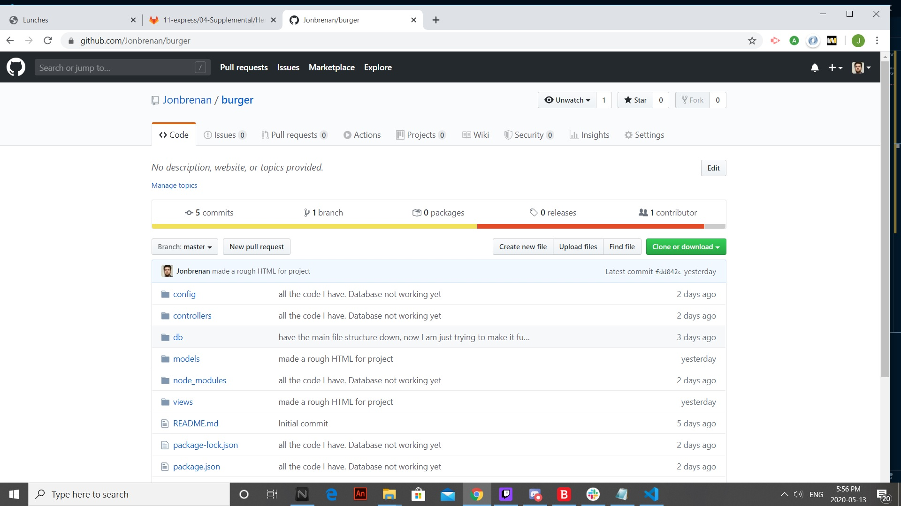
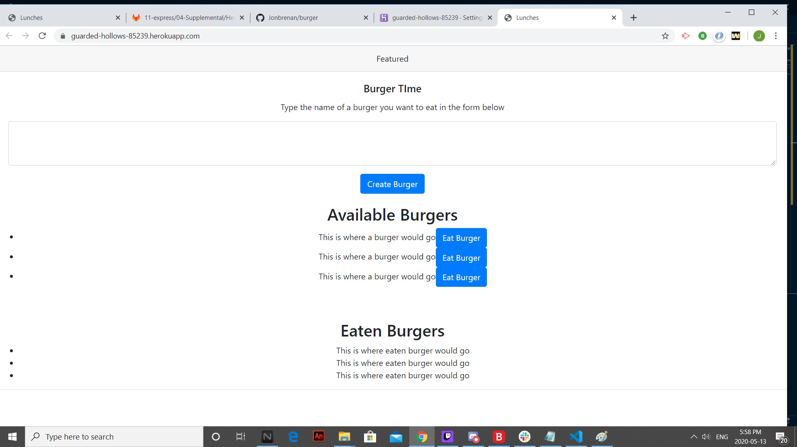

# README Generator

# Description
This project/code allows the user to retrieve and manipulate content from a database (MySQL). Specifically, it allows the user to create a hamburger (type hamburger name in and then click the 'create burger' buttob) and "eat" it, which moves the hamburger information from one table to another. (click the 'Eat Burger' button to eat the burger and move from one table to the 'eaten Burgers' table)
 

* [description](#description)
* [installation](#installation)
* [usage](#usage)
* [license](#license)
* [contributing](#contributing)
* [tests](#tests)
* [questions](#questions)

# Installation
to install the project, simply go to the github repository: https://github.com/Jonbrenan/burger, and download all files. Or, clone the repository to your computer. Make sure you have mySQL and VsCode installed. All files needed are found in this repository

# Usage
To use the application, simply go to this link: https://guarded-hollows-85239.herokuapp.com/. From here you can add and eat burgers (note, as of this time the website does not do anything)

# License
Licensed under the [MIT](LICENSE.txt) license
 
# Contributing
To see how one can contribute to the application, simply click the “Contributor Covenant” badge below. 

# Tests
no tests

# Questions

null